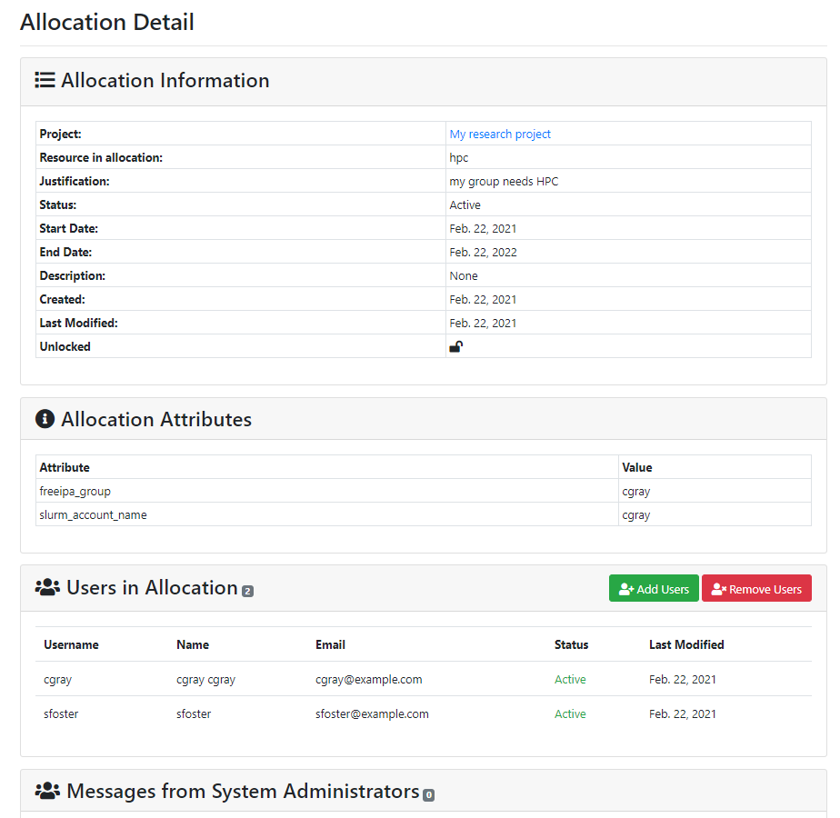
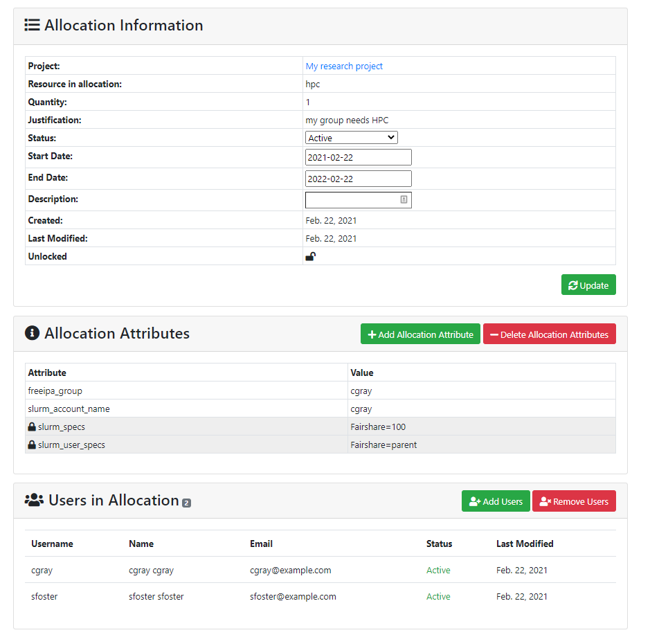
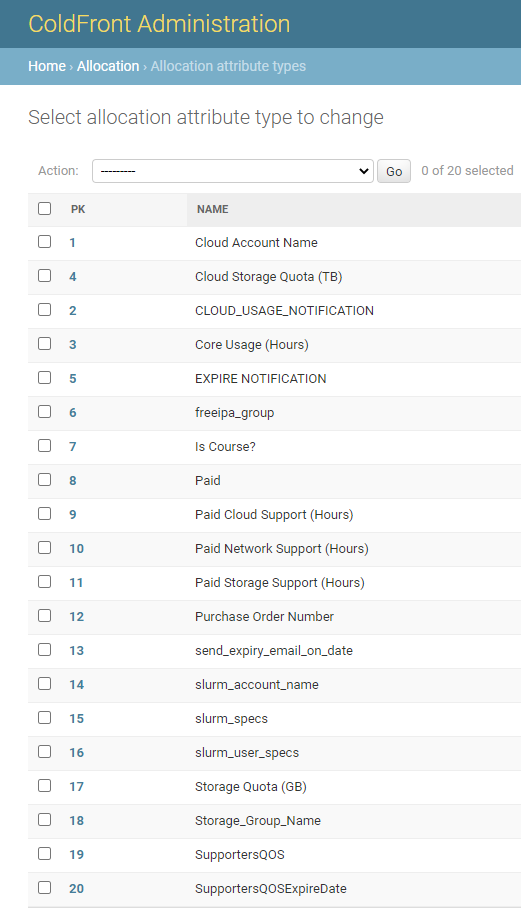

# What are Allocations?

Allocations in ColdFront are what provides the users access to a resource.  Allocations can contain attributes such as expiration dates that trigger email notifications.  Other attributes such has unix group, Slurm account, or storage quotas allow ColdFront plugins to interact with backend APIs and system processes.

- Allocations fall under projects in ColdFront.  
- A user must be a member of the project to be added to an allocation
- All project members do not need to be on all allocations
- Allocations can have many attributes and there are standard attributes configured in the base installation of ColdFront
- Additional attributes can be added to ColdFront using the ColdFront Administration Dashboard
- The types of attributes used on an allocation depend on what type of resource the allocation is for  
For example:  Cluster resource would have Slurm attributes, a Software License resource might have a UNIX group attribute, a Storage resource might have quota or directory attributes.
- NOTE: resources also have attributes that are inherited by the allocation.  This allows you to set an attribute once on the resource and not have to set it on every allocation for that resource.
- Attributes can be "public" which means they're visible to PIs and users on the allocation or they can be "private" and only viewable to administrators.
- Allocations must have an expiration date, at this time
- Emails are triggered to all users on an allocation when the expiration date is 60 days away, 30 days, 7 days, and then expired
- Users (not PIs or Managers) can turn off email notifications at the project level
- Once an allocation expires, access to that resource can be either removed or locked, depending on your Center's policy  
For example: When an allocation for a Slurm cluster expires, the Slurm plugin will remove the account and association, preventing users from running or submitting new jobs

## Allocation details
Access to ColdFront is role based so users see a read-only view of the allocation details for any allocations they are on.  PIs see the same allocation details as users and can also add project users to the allocation, if they're not already on it.  

### PI and Manager View
PIs and managers are able to view important details of the allocation including start and end dates, creation and last modified dates, users on the allocation and public allocation attributes.  PIs and managers are able to add or remove users from allocations.  

*NOTE:* the user must already be on the project in order to be added to the allocation.

### User View
Users who are not PIs or Managers on a project see a read-only view of the allocation details.  If a user is on a project but not a particular allocation, they will not be able to see the allocation in the Project view nor will they be able to access the Allocation detail page.

### Administrator View
Admins have the ability to update the status, start & end dates, and description on the Allocation Detail page.  They can also add or delete Allocation Attributes and Add or Remove Users.  All of this can also be done from the ColdFront Administration Dashboard.

*NOTE:* Users must exist on the Project before they can be added to the Allocation.  

## Creating new allocation attribute types  

ColdFront has a set of allocation attributes that tie into plugins.  You can add new allocation attributes in the ColdFront Administration Dashboard under Allocations - Allocation Attribute Types  

  

  

Click the 'Add Allocation Attribute Type' to create a new one.  Enter a name and select the type of attribute from: Date, Float, Int, Text, Yes/No

All attributes on an allocation are displayed on the Allocation Detail page.  If you do not want the PI and allocation users to see a particular attribute, check the "Is private" checkbox.  System administrators will be able to view these attributes on the allocation detail page but they'll be marked with a lock icon.  Any others viewing the allocation will not see them at all.

  
