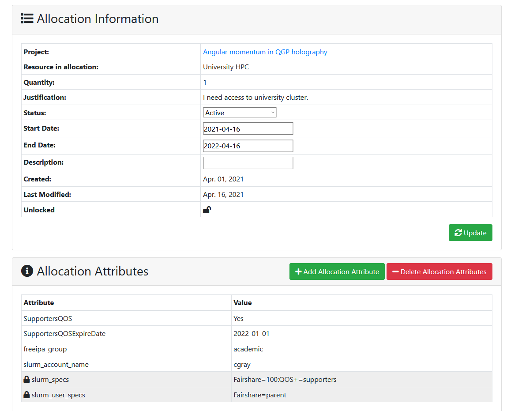
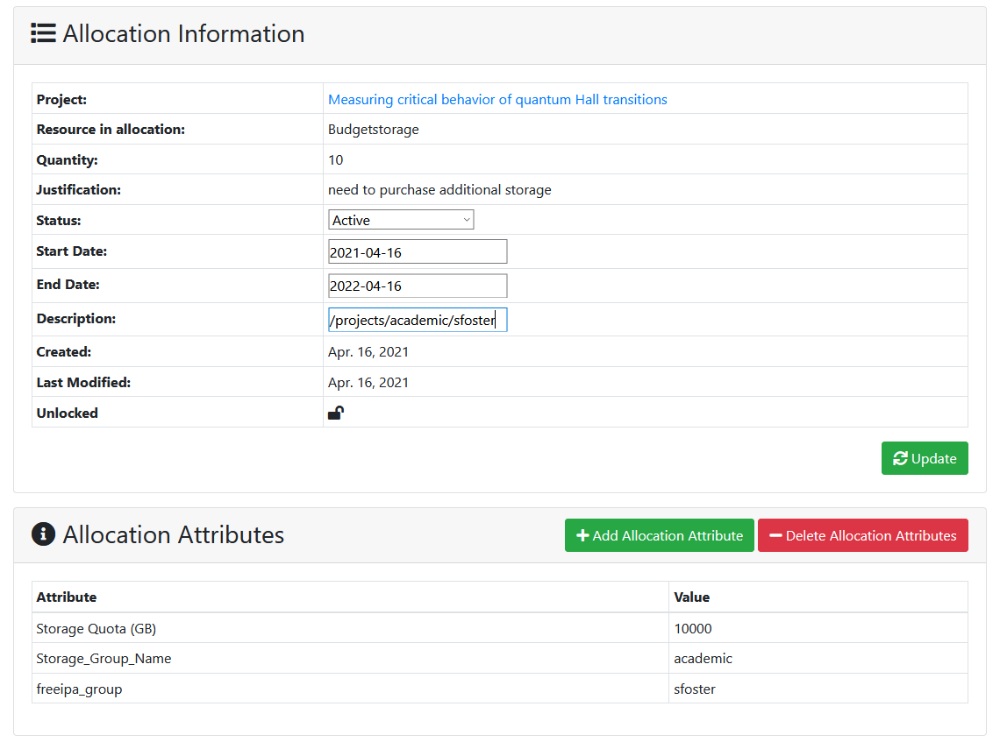
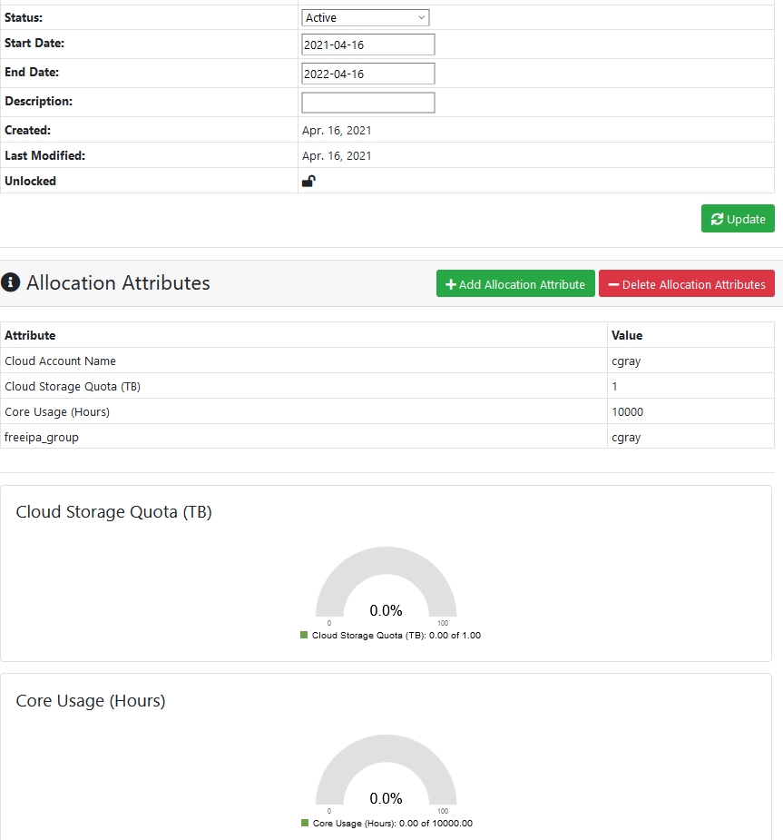

# Configuring Allocations   

The process of review allocation requests and configuring the allocation is very specific to your center's policies and procedures.  Allocation requests are accessible to the [center admin staff](../users/sysadmins.md) via the Admin - Allocation Requests menu.  

NOTE: If you'd like other staff to be able to view allocation requests without making them a 'super user' [check out these instructions](../users/staff.md#give-staff-access-to-review-allocation-requests)

## Project Review Status  

When a project review has been submitted but has not yet been approved by the center director or other staff, the 'project review status' shows as a blue exclamation point icon so the center staff that approve and configure allocations know they should wait to do so:

Once the project review has been approved, the icon changes to a green checkmark and the staff know the allocation approval process can proceed:

## Configuring and Activating New Allocations

This process will be completely dependent on how a center automates the backend systems for their resources.  To setup a new allocation, you will need to add attributes such as unix/AD groups that users must be in to access the resource, limits for CPU or storage use, directory paths, or slurm account settings.  Here we show the method and settings we use for a few types of resources, to give you an example of how you might use this at your center.  

### Cluster Resource Allocations  

In this example, we've updated the start and end date of the allocation, changed the status to 'Active,' and added allocation attributes that ensure the allocation users are in the correct unix group to access our cluster and are put into the PI's slurm account with appropriate fairshare settings.  This also shows how we enable Slurm QOS settings for groups to get a priority boost.  

  

### Storage Resource Allocations

Here we've updated the start and end date of the allocation, changed the status to 'Active', added the directory location in the 'description' field, and added allocation attributes that tie back to our storage system for automating quotas.  
    

### Cloud Resource Allocations  

The allocation detail page for cloud resource allocations will display usage charts if cloud-related attributes are added.  In this example, we've added the "Cloud Storage Quota" and "Core Usage" attributes, as well as a unix group, and cloud account name.  The usage metrics are drawn from Open XDMoD using the Openstack realm for cloud reporting.  More details can be [found here](https://github.com/ubccr/coldfront/tree/master/coldfront/plugins/xdmod)  

## Allocation Renewals

Allocation renewals may not require any additions or changes to the allocation attributes.  By default, if the admin clicks on the 'Activate' button the allocation status changes from "Renewal Requested" to "Active" and the expiration date is set to the ALLOCATION_DEFAULT_ALLOCATION_LENGTH set in the ColdFront configuration.  The default, if not configured, is 365 days.  An email notification is sent to the PI and all users on the allocation.

To set a different expiration date, change the status to anything other than 'Active' or modify any of the allocation attributes, click on the allocation ID to access the allocation detail page.  

To deny the allocation request, click the Deny button.  The allocation status will change to 'Denied' and the PI and users on the allocation will receive an email notification.  
