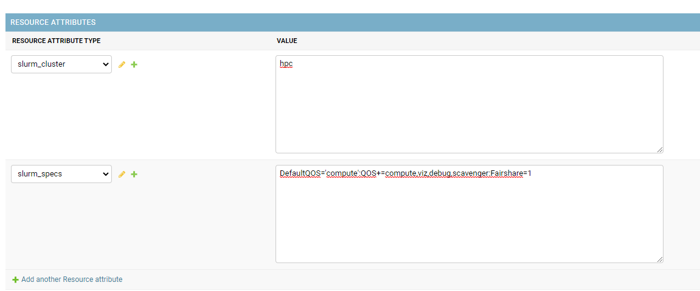
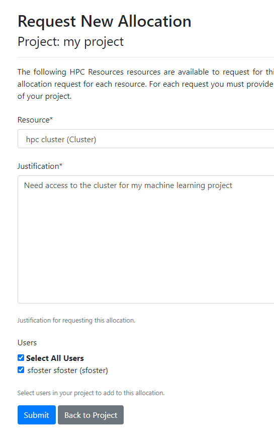
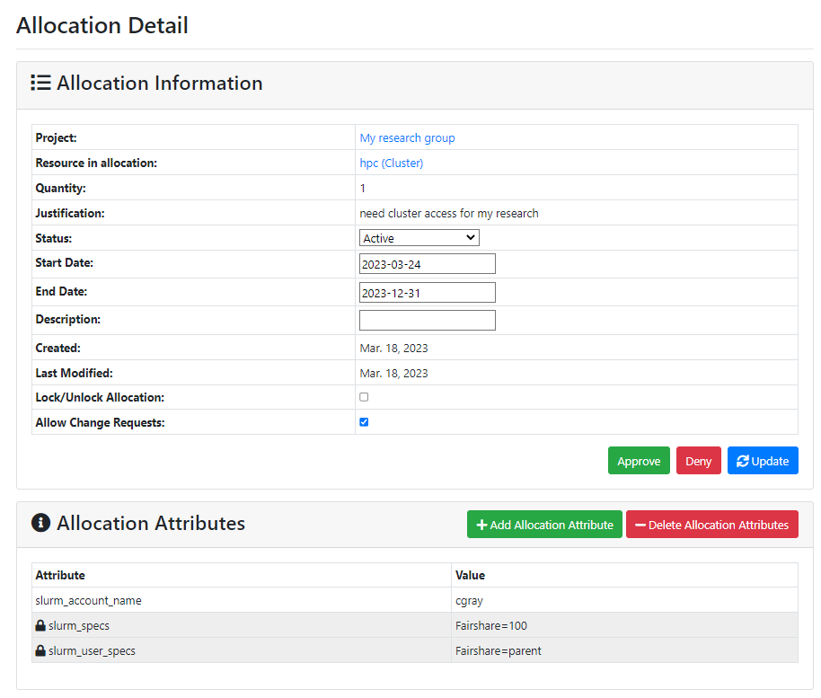

# Slurm Resource Setup  

A Slurm cluster needs to be created as a resource in ColdFront.  PIs would then request allocations for that resource.  Center admins would activate the allocation and associate attributes on the allocation for the Slurm plugin to interact with.

### Step 1 - Create the Resource

In the ColdFront admin interface, navigate to Resources.  Click on the "Add Resource" button and fill out the form.  This screenshot shows an example of a Cluster resource.


**Resource Type:** Cluster  
**Parent Resource:** leave blank  
**Is allocatable:** check  
**Name:** name of your cluster   
NOTE: this name will show up in the drop down list for PIs.  It can be multiple words and does not need to be the name of the slurm cluster.  We'll enter that as an attribute.    
**Description:** a description of the resource  
**Is available:** check  
**Is public:** check   
**Allowed groups and allowed users:**  You can add these restrictions if you want to make the resource available only to a selection of users/groups  


Under "Resource Attributes" click "Add another resource attribute"  
Select slurm cluster from the attribute menu and enter the name of your Slurm cluster (found in slurm_cluster.conf)  
Select slurm_specs from the attribute menu and enter any slurm specs necessary for your cluster.  These are found in the slurm_cluster.conf file as well and include default values and other options you want inherited for all accounts on that cluster.  See the screenshot below as an example.  The slurm_specs and slurm_user_specs attributes can also be added to allocations for the resource.  When on the allocation, they apply to only the slurm account on that allocation, not the whole cluster.

**Click the 'SAVE' button!**



### Step 2 - Create an Allocation for the Resources

Login as the PI and request an allocation for the new resource.  
- Under the PI's project, click 'Request Resource Allocation'  
- Select the cluster resource off the drop down list and enter a justification.  This is usually used by centers to get PIs to say why they need access to a particular resource.  
- Select any other project users to add to the allocation.  
- Click the Submit button.  



A new allocation is created with a status of 'New'  No access is provided to the user until the allocation is activated.

### Step 3 - Activate the allocation

When logged in as a center admin, navigate to the Admin menu and click on 'Allocation Requests'  


From here, the admin has a few options:  
- You can click on the project title and you'll be redirected to the Project Detail page  
- You can click on the allocation ID number and you'll be redirected to the Allocation Detail page  
- You can click on the "Deny" button and the allocation status will change to 'denied.'  The PI and allocation users will get an email notifying them that the allocation has been denied.  
- If you click on the "Approve" button, the allocation status will update to 'active' and the expiration date will be set one year out.  

Most of the time, we want to set allocation attributes on the allocation before approving it, so that the plugins can interact and accounts get updated.  In this example, we want to set some Slurm attributes on the allocation before activating it.  Click on the allocation ID number to go to the Allocation detail page:  



Here we add 3 slurm attributes to the allocation:
- slurm_account_name = PIusername (this will depend on how you name your slurm accounts - PI name, project name/ID, etc)
- slurm_specs = Fairshare=100 (this is the fairshare applied to the slurm account)
- slurm_user_specs = Fairshare=parent (this is the fairshare value inherited by all the associations of the slurm account)

We also change the status of the allocation to 'Active' and set today's date and the end date of the allocation.  If your allocation is good for one year, you could also go back to the "Allocation Requests" page and click the "Approve" button to set this all automatically.


### Step 4 - Sync with Slurm  

Your [ColdFront config](../../config.md) must have the [Slurm plugin](https://github.com/ubccr/coldfront/tree/master/coldfront/plugins/slurm) enabled and you'll need the Slurm client installed on your ColdFront instance so it can run the slurm commands.  

Within your ColdFront virtual environment, dump the Slurm account and association from ColdFront:  

```
-c = cluster name  
-o = output location  

coldfront slurm_dump -c hpc -o ~/slurm_dump
cat ~/slurm_dump/hpc.cfg
# ColdFront Allocation Slurm associations dump 2021-04-01
Cluster - 'hpc':DefaultQOS='compute':Fairshare=1:QOS+=compute,viz,debug,scavenger
Parent - 'root'
User - 'root':DefaultAccount='root':AdminLevel='Administrator':Fairshare=1
Account - 'cgray':Fairshare=100
Parent - 'cgray'
User - 'cgray':Fairshare=parent
User - 'sfoster':Fairshare=parent
```

This command outputs the slurm information from all ACTIVE allocations for cluster resources.  

Now load the dump into the slurm database - this slurm command does a diff between what is currently in the database and ADDS anything new it finds in this file.  It does NOT remove anything.  You'll see a listing of the changes it intends to make and have the option to accept them or cancel out.

```
sacctmgr load file=~/slurm_dump/hpc.cfg
For cluster hpc
Accounts
      Name                Descr                  Org                  QOS
---------- -------------------- -------------------- --------------------
     cgray                cgray                cgray
---------------------------------------------------

Account Associations
   Account   Par Name     Share   GrpTRESMins GrpTRESRunMin       GrpTRES GrpJobs GrpJobsAccrue  GrpMem GrpNodes GrpSubmit     GrpWall   MaxTRESMins       MaxTRES MaxTRESPerNode MaxJobs MaxSubmit MaxNodes     MaxWall                  QOS   Def QOS
---------- ---------- --------- ------------- ------------- ------------- ------- ------------- ------- -------- --------- ----------- ------------- ------------- -------------- ------- --------- -------- ----------- -------------------- ---------
     cgray       root       100                                                                                                     
--------------------------------------------------------------

Users
      Name   Def Acct  Def WCKey                  QOS     Admin       Coord Accounts
---------- ---------- ---------- -------------------- --------- --------------------
     cgray      cgray                                   Not Set
---------------------------------------------------

User Associations
      User    Account     Share   GrpTRESMins GrpTRESRunMin       GrpTRES GrpJobs GrpJobsAccrue  GrpMem GrpNodes GrpSubmit     GrpWall   MaxTRESMins       MaxTRES MaxTRESPerNode MaxJobs MaxSubmit MaxNodes     MaxWall                  QOS   Def QOS
---------- ---------- --------- ------------- ------------- ------------- ------- ------------- ------- -------- --------- ----------- ------------- ------------- -------------- ------- --------- -------- ----------- -------------------- ---------
     cgray      cgray    parent                                                                                                     
   sfoster      cgray    parent                                                                                                     
--------------------------------------------------------------

sacctmgr: Done adding cluster in usec=440457
Would you like to commit changes? (You have 30 seconds to decide)
(N/y): y

```

That's it!  This can be cron'd to run on a regular basis or run manually so staff can ensure accuracy.


### Removing access for expired or revoked allocations

When an allocation for a slurm resource expires or is revoked, we want to remove the slurm account and associations on that allocation.  To do that, run the slurm_check process:

```
coldfront slurm_check -h
usage: coldfront slurm_check [-h] [-i INPUT] [-c CLUSTER] [-s] [-n]
                             [-u USERNAME] [-a ACCOUNT] [-x] [--version]
                             [-v {0,1,2,3}] [--settings SETTINGS]
                             [--pythonpath PYTHONPATH] [--traceback]
                             [--no-color] [--force-color]

Check consistency between Slurm associations and ColdFront allocations

optional arguments:
  -h, --help            show this help message and exit
  -i INPUT, --input INPUT
                        Path to sacctmgr dump flat file as input. Defaults to
                        stdin
  -c CLUSTER, --cluster CLUSTER
                        Run sacctmgr dump [cluster] as input
  -s, --sync            Remove associations in Slurm that no longer exist in
                        ColdFront
  -n, --noop            Print commands only. Do not run any commands.
  -u USERNAME, --username USERNAME
                        Check specific username
  -a ACCOUNT, --account ACCOUNT
                        Check specific account
  -x, --header          Include header in output
  --version             show program's version number and exit
  -v {0,1,2,3}, --verbosity {0,1,2,3}
                        Verbosity level; 0=minimal output, 1=normal output,
                        2=verbose output, 3=very verbose output
  --settings SETTINGS   The Python path to a settings module, e.g.
                        "myproject.settings.main". If this isn't provided, the
                        DJANGO_SETTINGS_MODULE environment variable will be
                        used.
  --pythonpath PYTHONPATH
                        A directory to add to the Python path, e.g.
                        "/home/djangoprojects/myproject".
  --traceback           Raise on CommandError exceptions
  --no-color            Don't colorize the command output.
  --force-color         Force colorization of the command output.

```

You can run it and check by slurm account name or provide a slurm flat file. If you run in --noop mode, you'll be provided with a list of the changes to review.  If you run in --sync mode the changes will be made without intervention.  In the example above, if we expire the cgray allocation and then run this slurm_check tool, we see:

```
coldfront slurm_check --noop -c hpc -a cgray
NOOP enabled
cgray   cgray   hpc     Remove
sfoster cgray   hpc     Remove
        cgray   hpc     Remove
```
If we run without specifying the account, we may see additional accounts and associations that need to be removed:

```
coldfront slurm_check --noop -c hpc
NOOP enabled
cgray   cgray   hpc     Remove
sfoster cgray   hpc     Remove
        cgray   hpc     Remove
astewart        sfoster hpc     Remove
sfoster sfoster hpc     Remove
        sfoster hpc     Remove
hpcadmin        staff   hpc     Remove
        staff   hpc     Remove
```
This can be cron'd like the slurm_dump process or run manually.
